

# Edviora

  

An intelligent cloud-based ERP platform that unifies academic management, administration, finance, communication, and artificial intelligence into a secure, scalable, and modern ecosystem for educational institutions.

---

# Table of Contents

- Overview
- Vision
- User Roles
- Platform Architecture
- Platform Workflow
- Platform Layers
- Core Modules
- AI Workflow
- Authentication & Authorization
- Platform Capabilities
- Overall System Workflow
- Deployment Architecture
- Application Gallery
- Performance
- Security
- Frequently Asked Questions
- Contact
- Chanakya AI
- License

---

# Overview

Edviora is a modern **AI-powered School ERP and Institution Management Platform** designed to simplify and automate academic, administrative, and operational workflows through a unified cloud-based architecture.

Instead of relying on multiple disconnected systems for attendance, examinations, fee collection, payroll, communication, transportation, analytics, and institutional administration, Edviora brings every essential service together into a single intelligent platform.

Built for **schools, colleges, universities, coaching institutes, and educational organizations**, the platform emphasizes automation, scalability, security, and an exceptional user experience.

---

# Vision

Our vision is to build a modern digital ecosystem that enables educational institutions to operate more efficiently through intelligent software and data-driven decision making.

Edviora combines administration, learning, communication, analytics, and artificial intelligence into one integrated platform that scales with institutions of every size.

### Core Principles

| Principle | Description |
|-----------|-------------|
| Artificial Intelligence | Intelligent automation across institutional workflows |
| Cloud-Native Architecture | Secure, scalable, and highly available infrastructure |
| Data-Driven Insights | Actionable analytics for better decision making |
| Security First | Enterprise-grade authentication and authorization |
| Modern User Experience | Responsive and intuitive interface across devices |
| Operational Excellence | Streamlined administration with reduced manual effort |

---

# User Roles

Edviora provides dedicated dashboards and role-based permissions for every stakeholder.

| Role | Responsibilities |
|------|------------------|
| Administrator | Institution configuration and operational management |
| Teacher | Attendance, academics, examinations, classroom management |
| Student | Learning resources, attendance, assignments, academic records |
| Parent | Student progress tracking and communication |
| Accountant | Fee collection, payroll, financial reporting |
| Transport Manager | Vehicle allocation, route planning, transport monitoring |

---

# Platform Architecture

<b>Figure 1.</b> High-level architecture of the Edviora platform.

---

# Platform Workflow

<b>Figure 2.</b> End-to-end operational workflow of the Edviora platform.

# Platform Layers

The Edviora platform is organized into multiple service layers that work together to deliver a secure, scalable, and intelligent institution management experience.

| Layer | Responsibility |
|--------|----------------|
| Client Application | Responsive web interface for all stakeholders |
| Authentication & Authorization | Secure identity management and access control |
| Academic Services | Student lifecycle, attendance, curriculum, examinations |
| Financial Services | Fees, payroll, billing, financial operations |
| AI Services | Chanakya AI, intelligent recommendations, learning assistance |
| Communication Services | SMS, WhatsApp, Email, notifications |
| Analytics & Reporting | Dashboards, reports, institutional insights |
| Data Platform | Secure storage and centralized information management |

---

# Core Platform Modules

Edviora is built around modular services that simplify every aspect of educational institution management. Each module operates independently while integrating seamlessly across the platform.

---

## Student Management

Centralized lifecycle management for student admission, academic records, parent relationships, identification, and archival.

**Capabilities**

- Student Registration
- Student Profiles
- Digital Student Records
- Scholar Register (SR)
- Parent & Guardian Linking
- Medical Information
- QR Student ID Cards
- Academic History
- Student Promotion
- Student Transfer
- Document Management
- Physical Growth Records
- Student Archive

### Student Lifecycle

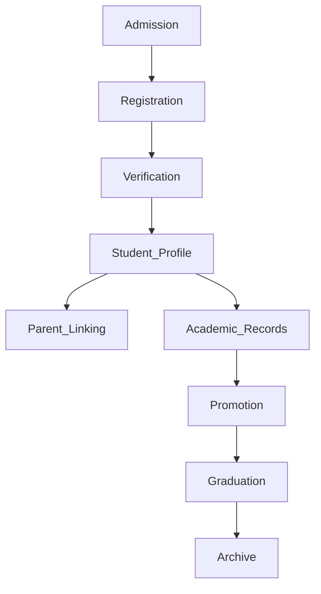

---

## Teacher Management

Manage teaching staff, departmental assignments, attendance, scheduling, and institutional workforce operations through a unified administration portal.

**Capabilities**

- Teacher Registration
- Subject Assignment
- Department Management
- Class Allocation
- Attendance Management
- Timetable Management
- Leave Management
- Salary Records
- Performance Reports
- Profile Management

---

## Attendance Management

A comprehensive attendance system designed to improve accuracy, reduce manual work, and provide real-time visibility into institutional attendance records.

**Capabilities**

- Daily Attendance
- Monthly Attendance
- QR Attendance
- Bulk Attendance
- Leave Management
- Holiday Management
- Late Entry Tracking
- Attendance Reports
- Attendance Analytics

### Attendance Workflow

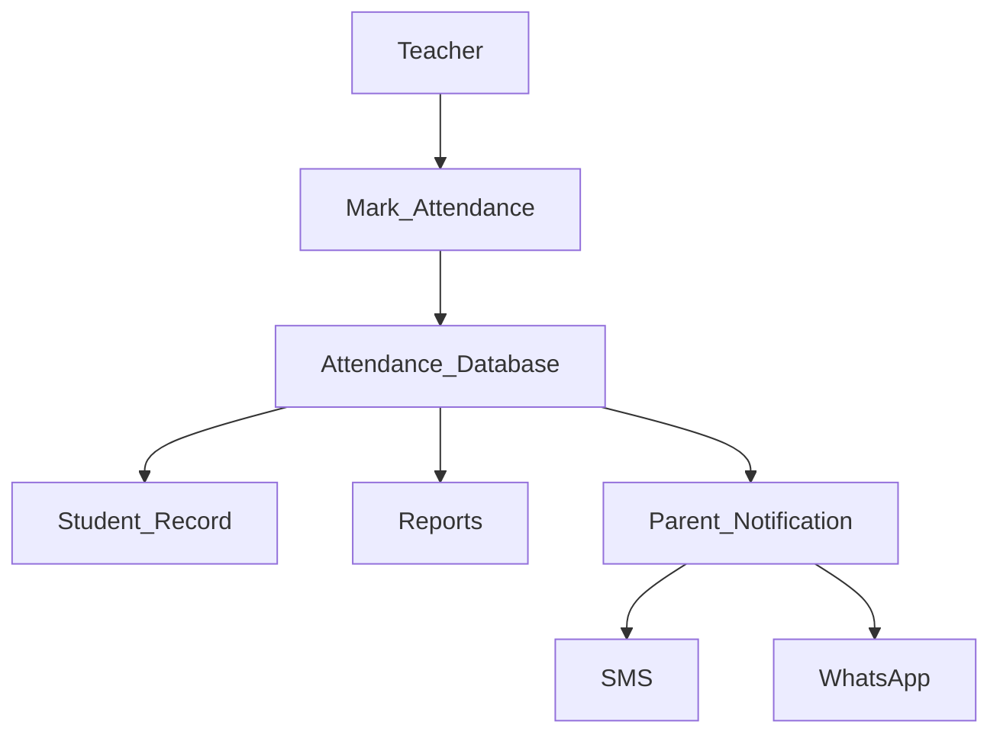

---

## Academic Management

Manage academic operations from curriculum planning to classroom activities and AI-assisted learning resources.

**Capabilities**

- Subject Management
- Class & Section Management
- Curriculum Registry
- School Calendar
- Notes Management
- Homework
- Assignments
- Study Guides
- AI Study Hub
- AI Evaluation
- Student Help Center

---

## Examination & Result Management

Digitize examination planning, grading, performance evaluation, and academic reporting.

**Capabilities**

- Exam Scheduling
- Marks Entry
- Grade Calculation
- GPA Calculation
- Rank Generation
- Report Cards
- Performance Tracking
- Result Analytics

---

## Financial Management

Centralized financial services supporting student billing, payroll, institutional accounting, and financial reporting.

### Fee Management

**Capabilities**

- Fee Categories
- Student Billing
- Online Payments
- Installment Management
- Due Fee Tracking
- Fee Receipts
- Payment History
- Scholarship Management
- Bulk CSV Upload
- Automated Fee Reminders

### Fee Workflow

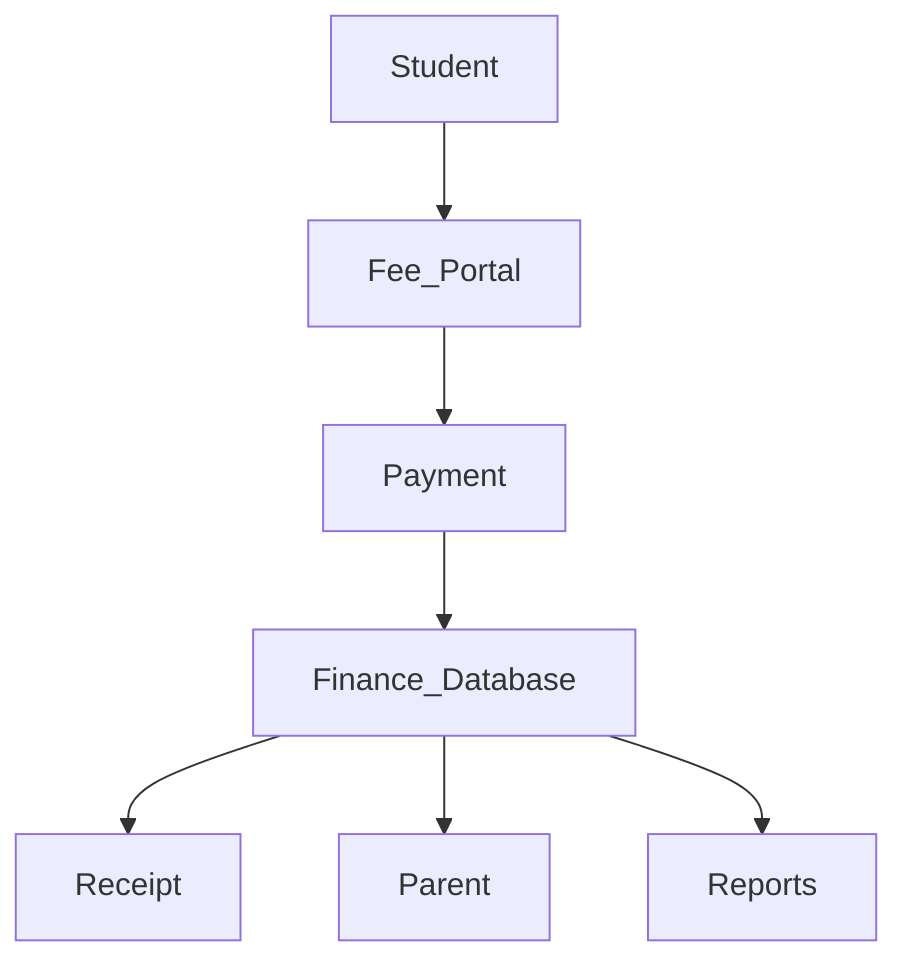

### Payroll Management

**Capabilities**

- Salary Generation
- Payroll Processing
- Benefits Management
- Salary Slips
- Bonus Management
- Tax Reports
- Deductions

---

## Transport Management

Digitally manage transportation resources, student routes, vehicle tracking, and driver operations.

**Capabilities**

- Vehicle Management
- Driver Management
- Route Planning
- Student Vehicle Assignment
- GPS Tracking
- Pickup & Drop Monitoring
- Transport Reports
  # AI Workflow

Chanakya AI powers intelligent decision-making across the Edviora platform by processing user requests, retrieving relevant information, and generating context-aware responses.

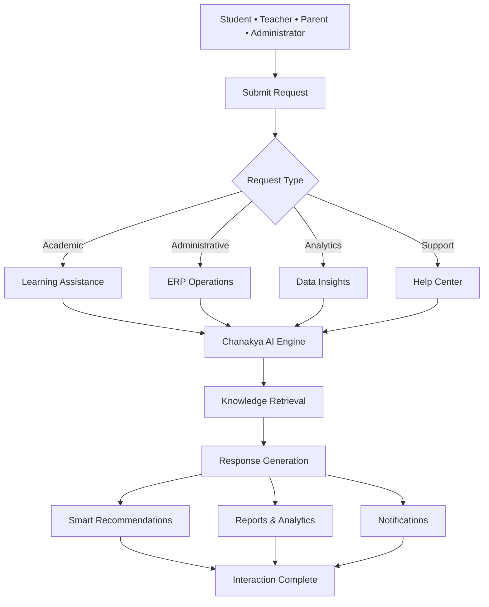

---

# Analytics & Reporting

Transform institutional data into meaningful insights that improve operational efficiency and academic performance.

**Capabilities**

- Attendance Analytics
- Academic Performance Reports
- Financial Reports
- Payroll Analytics
- Transport Reports
- Student Statistics
- Teacher Performance
- Institutional Insights

---

# Communication Center

Deliver real-time communication between administrators, teachers, students, and parents through integrated notification services.

**Capabilities**

- SMS Notifications
- WhatsApp Notifications
- Email Notifications
- Parent Alerts
- School Announcements
- Emergency Notifications
- Broadcast Messaging

---

# Timetable Management

Automate schedule planning while reducing classroom and faculty conflicts.

**Capabilities**

- Teacher Timetable
- Student Timetable
- Classroom Allocation
- Automatic Scheduling
- Conflict Detection
- Timetable Export

---

# School Calendar

Manage institutional events and academic schedules from a centralized calendar.

**Capabilities**

- Holidays
- Academic Sessions
- Events
- Examinations
- Parent Meetings
- Announcements

---

# Authentication & Authorization

Role-based authentication ensures secure access across every module of the platform while protecting institutional data.

**Supported Roles**

- Administrator
- Principal
- Teacher
- Student
- Parent
- Accountant
- Transport Manager

### Authentication Flow

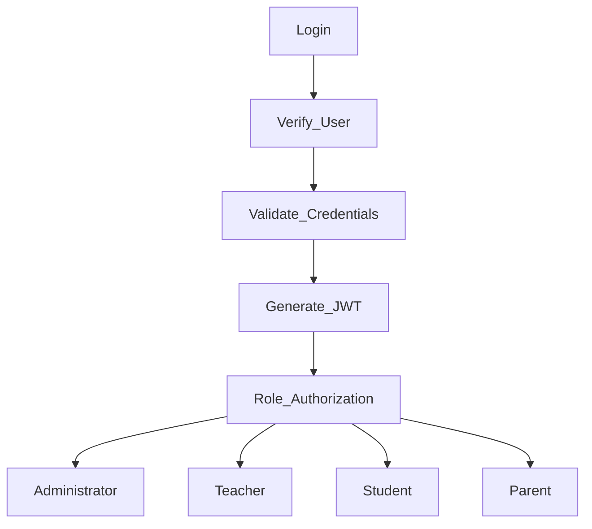

---

# Platform Capabilities

| Domain | Services |
|---------|----------|
| Student Services | Registration, Profiles, Academic Records, QR Student ID |
| Academic Services | Attendance, Curriculum, Examination, AI Study Hub |
| Administration | Teacher Management, Timetable, School Calendar |
| Financial Services | Fee Management, Payroll |
| Communication | SMS, WhatsApp, Email Notifications |
| Analytics | Reports, Dashboards, Institutional Insights |
| Transportation | Vehicle & Route Management |
| AI Services | Chanakya AI, Smart Recommendations, Learning Assistance |

---

# Overall System Workflow

The following workflow illustrates how users interact with the platform and how core services operate together.

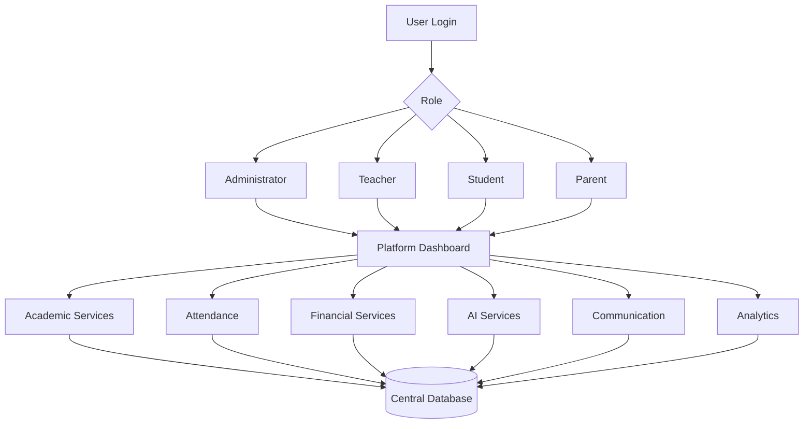

---

# Deployment Architecture

The deployment architecture illustrates how Edviora delivers secure, scalable, and cloud-native services across the institution.

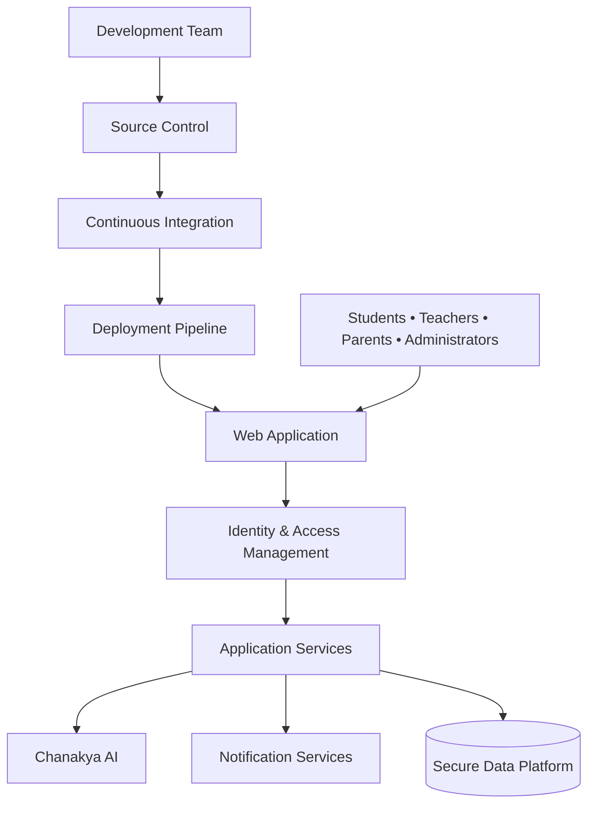
# 🖼️ Application Gallery

Explore the Edviora platform through key interfaces that demonstrate its user experience, administrative capabilities, and AI-powered workflows.

 

<table align="center" width="100%">
<tr>

<td width="50%" align="center" valign="top">

### Dashboard

<a href="../images/first.jpeg">
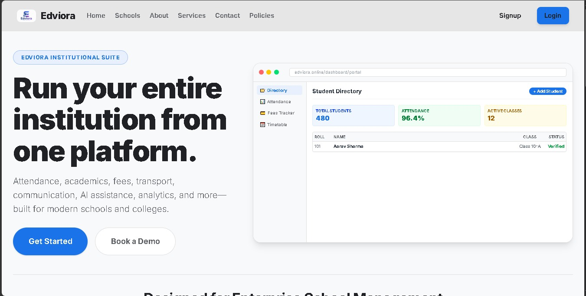
</a>

</td>

<td width="50%" align="center" valign="top">

### Student Management

<a href="../images/second.jpeg">
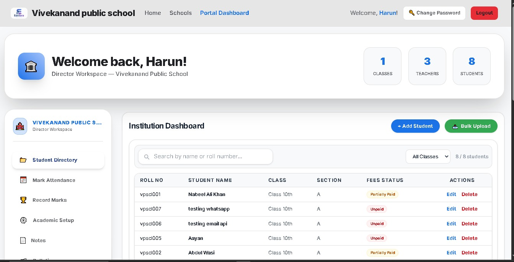
</a>

</td>

</tr>

<tr>

<td width="50%" align="center" valign="top">

### Attendance Module

<a href="../images/third.jpeg">
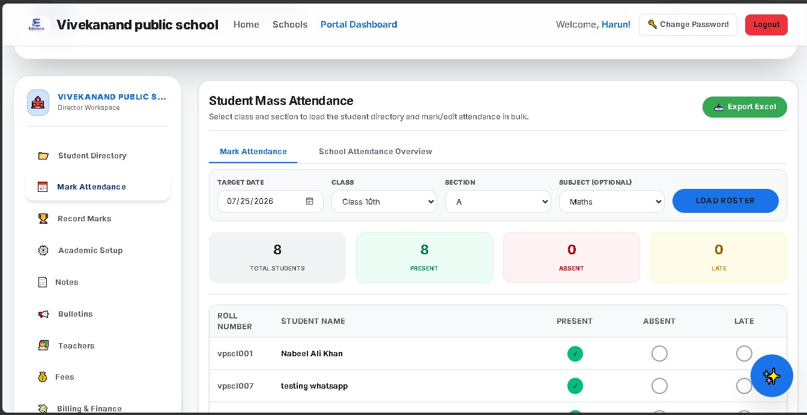
</a>

</td>

<td width="50%" align="center" valign="top">

### AI Assistant

<a href="../images/forth.jpeg">
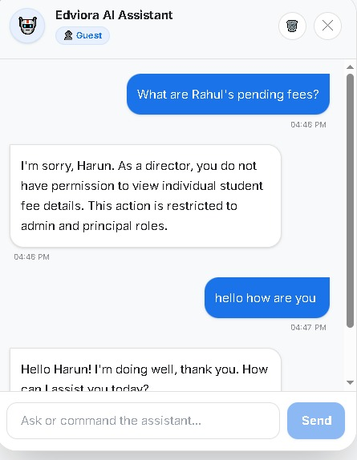
</a>

</td>

</tr>

</table>

 

### Analytics Dashboard

<a href="../images/five.jpeg">
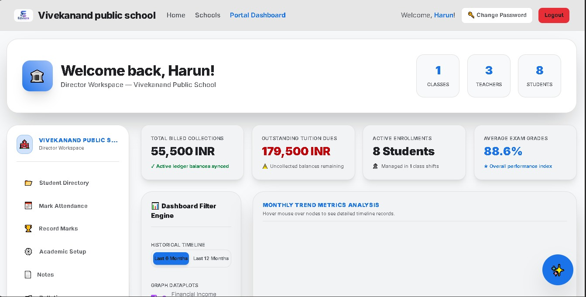
</a>

<i>Click any screenshot to view it in full resolution.</i>

---

# Performance Goals

Edviora is designed to deliver responsive performance, high availability, and enterprise-grade reliability.

| Metric | Target |
|---------|--------|
| Dashboard Load Time | < 2 seconds |
| API Response Time | < 500 ms |
| Platform Availability | 99.9% |
| Security Standard | Enterprise Grade |
| Scalability | Multi-Institution |

---

# Security

Security is integrated into every layer of the platform through modern authentication, authorization, and secure development practices.

| Security Feature | Description |
|------------------|-------------|
| JWT Authentication | Secure user authentication |
| Role-Based Access Control | Permission-based access management |
| Password Hashing | Secure credential protection |
| Protected API Endpoints | Authorized resource access |
| Session Management | Secure user sessions |
| Input Validation | Protection against malicious requests |
| Environment Variables | Secure configuration management |
| Activity Logging | Audit trail for user actions |

---

# Frequently Asked Questions

<strong>Is Edviora open source?</strong>

The repository is publicly accessible for demonstration purposes. Licensing and deployment depend on the project's distribution model.

<strong>Can multiple institutions use Edviora?</strong>

Yes. The platform is designed with multi-institution support and centralized administration.

<strong>Does Edviora include AI capabilities?</strong>

Yes. Chanakya AI provides intelligent assistance, recommendations, workflow automation, and academic support.

<strong>Is the platform mobile responsive?</strong>

Yes. Edviora is optimized for desktop, laptop, tablet, and mobile devices.

---

# Contact

| Platform | Information |
|----------|-------------|
| Website | https://edviora.online |
| GitHub | https://github.com/Edviora-Organization |
| LinkedIn | https://www.linkedin.com/company/edviora |
| Email | nabeel03103n@gmail.com |

---

# Powered by Chanakya AI

Edviora integrates **Chanakya AI** to enhance institutional management through intelligent automation, personalized assistance, and data-driven insights.

### AI Capabilities

- Conversational AI Assistant
- Personalized Learning Support
- AI Question Generation
- Assignment Assistance
- Smart Recommendations
- Report Generation
- Study Planning
- Academic Insights

### Chanakya AI

Founded by **Nabeel Ali Khan**

🌐 https://chanakyaai.in/

💻 https://github.com/nabeelalikhan0

---

# License

Copyright © 2026 **Edviora**.

All rights reserved.

---

## Edviora

Building the future of educational institutions through cloud technology, artificial intelligence, and intelligent automation.

**Made with ❤️ by the Edviora Team**

🌐 https://edviora.online

If you found this project useful, consider giving it a ⭐ on GitHub.

