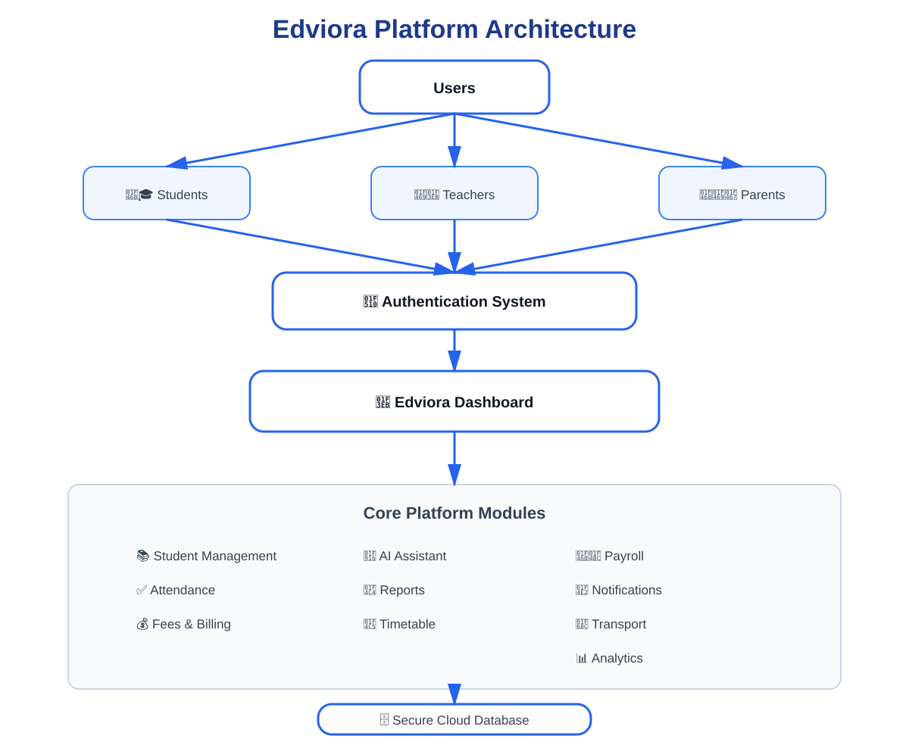
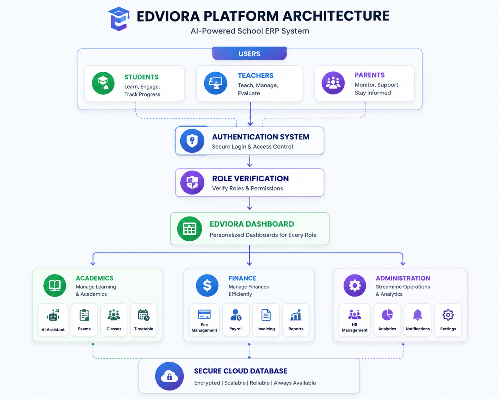
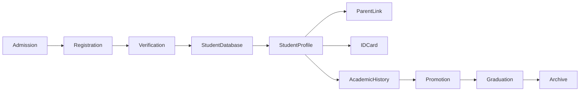
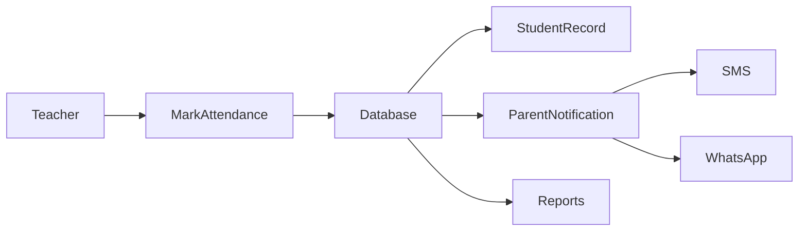
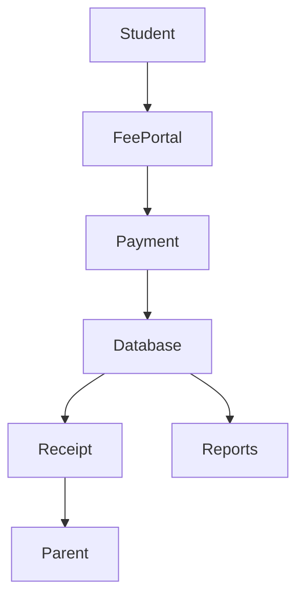
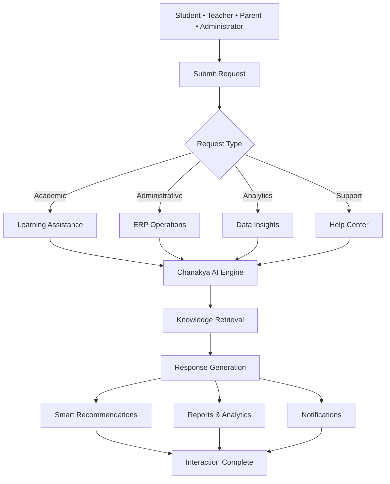
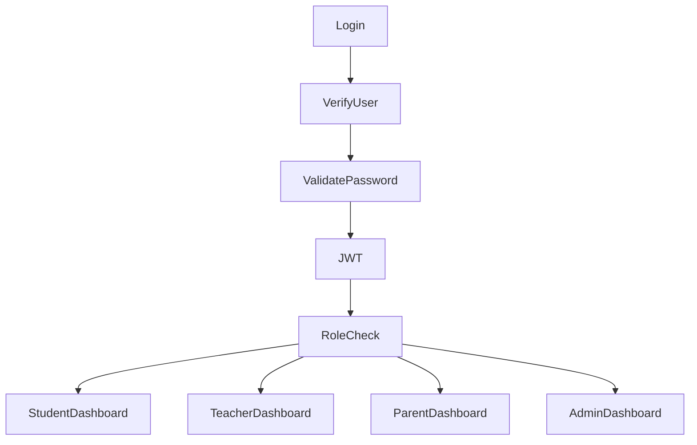
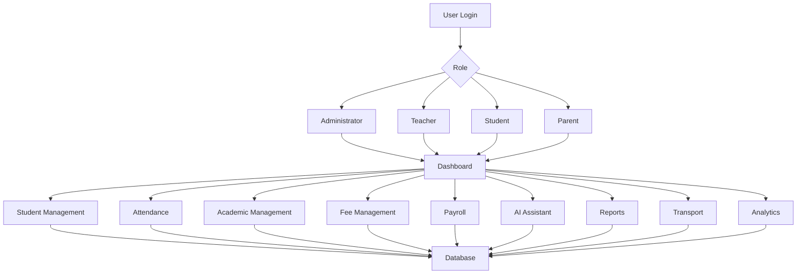
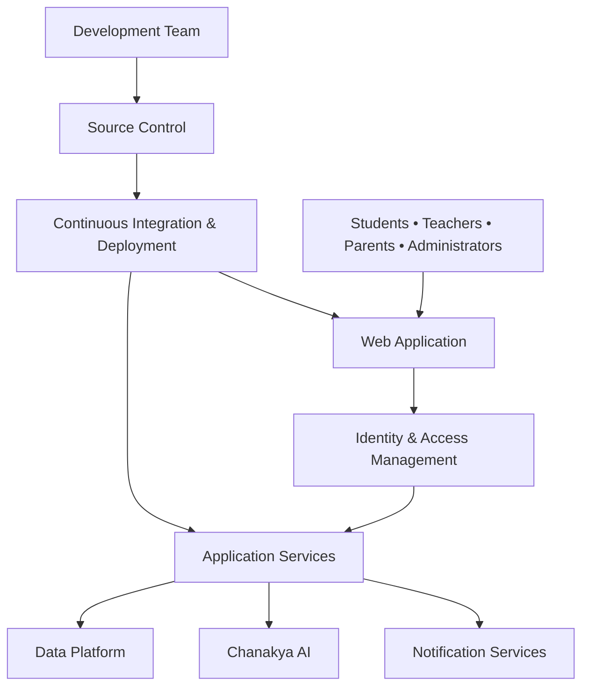

<h1 align="center">🎓 Edviora</h1>

  

An intelligent cloud-based ERP platform designed to transform educational institutions through automation, AI, analytics, and seamless collaboration.

---

##  Overview

**Edviora** is a next-generation **AI-powered School ERP platform** built to simplify and automate every aspect of educational institution management.

Instead of using multiple disconnected systems for attendance, academics, fee collection, payroll, communication, transport, analytics, and administration, Edviora integrates everything into **one intelligent cloud platform**.

Designed for **schools, colleges, coaching institutes, and educational organizations**, Edviora provides a secure, scalable, and modern digital ecosystem that reduces administrative effort while enhancing learning outcomes.

---

## Vision

Edviora is building a modern platform for educational institutions that simplifies academic and administrative operations through intelligent software.

Our goal is to provide a unified platform that combines learning, administration, communication, and analytics into a single, secure, and scalable ecosystem.

Core principles:

- Artificial Intelligence
- Data-Driven Insights
- Cloud-Native Infrastructure
- Secure Authentication
- Modern User Experience
- Intelligent Automation

Overview
Vision
Architecture
Workflow
Technology Stack

Platform Capabilities

 Academic Services
Student Information • Attendance • Curriculum • Report Cards • AI Study Hub

 Financial Services
Fee Management • Payroll • Billing • Financial Reports

 AI & Intelligence
Chanakya AI • AI Assistant • Recommendations • Analytics

 Administration
Teacher Management • Multi-School • Timetable • Transport • Notifications

Security
Deployment
Getting Started

#  Why Choose Edviora?

✅ Modern Dashboard

✅ AI Powered

✅ Enterprise Architecture

✅ Cloud Ready

✅ Secure Authentication

✅ Responsive Design

✅ Mobile Friendly

✅ Role Based Access

✅ Fast Performance

✅ Intelligent Analytics

✅ Easy to Use

✅ Scalable Infrastructure

---

#  User Roles

Edviora provides customized dashboards and permissions for every stakeholder.

| Role | Description |
|------|-------------|
|  Administrator | Complete institution management |
|  Teacher | Attendance, Reports, Classes |
|  Student | Learning Resources, Fees, Attendance |
|  Parent | Child Progress & Notifications |
|  Accountant | Fee Collection & Payroll |
|  Transport Manager | Vehicle & Route Management |

---

## 🏗 Platform Architecture

  

## ⚙️ Platform Workflow

  

<b>Figure 2.</b> Complete workflow of the Edviora AI-Powered School ERP Platform.

---

#  Platform Layers

| Component | Responsibility |
|------------|----------------|
|  Client Application | User Interface |
|  Authentication | Secure Access Control |
|  Academic Services | Attendance, Exams, Notes |
|  Financial Services | Fees, Payroll, Billing |
|  AI Services | AI Assistant & Study Hub |
|  Communication | SMS, WhatsApp & Notifications |
|  Analytics | Reports & Insights |
|  Database | Secure Data Storage |

---

## Security

Security is built into every layer of the platform. Edviora follows modern authentication and authorization practices to protect user data and system resources.

### Features

- JWT-based authentication
- Role-based access control (RBAC)
- Secure password hashing
- Protected API endpoints
- Session management
- Access control for protected resources
- Activity and audit logging
- Cloud-ready security architecture
  

#  Responsive Design

Edviora works seamlessly across all devices.

| Device | Supported |
|----------|-----------|
| 💻 Desktop | ✅ |
| 🖥 Laptop | ✅ |
| 📱 Mobile | ✅ |
| 📲 Tablet | ✅ |

---

#  Platform Statistics

| Category | Coverage |
|-----------|----------|
| Modules | 25+ |
| Dashboards | 6 |
| AI Features | 5+ |
| Reports | 20+ |
| User Roles | 6 |
| Cloud Ready | ✅ |
| Responsive | ✅ |

---

---

## Core Platform Modules

Edviora is organized into independent modules that cover the core operations of an educational institution. Each module is designed to work independently while integrating seamlessly with the rest of the platform.

---

# 👨‍🎓 Student Management

The Student Management module provides a centralized system for managing student information throughout the academic lifecycle, from admission to graduation.

### Features

- Student Registration
- Student Profile Management
- Digital Student Records
- Student Scholar Register (SR)
- Student Promotion
- Academic History
- Parent & Guardian Linking
- Medical Information
- Blood Group Records
- Document Management
- QR Code Student ID Cards
- Student Search & Filtering
- Student Transfer
- Physical Growth Records
- Student Archive

### Student Workflow

### Benefits

- Centralized student database
- Digital student records
- Faster admission and administration
- Paperless document management
- Quick search and retrieval
- Improved data accuracy

#  Teacher Management

Manage teachers, departments, subjects, schedules, and classroom activities from one dashboard.

### Features

- Teacher Registration
- Subject Assignment
- Class Assignment
- Department Management
- Teacher Attendance
- Teacher Timetable
- Performance Reports
- Leave Management
- Salary Records
- Profile Management

---

#  Attendance Management

A smart attendance system designed for accuracy and automation.

### Features

- Daily Attendance
- Monthly Attendance
- Bulk Attendance
- QR Attendance
- Attendance Reports
- Late Entry Tracking
- Holiday Management
- Leave Tracking
- Attendance Analytics

### Attendance Workflow

---

#  Academic Management

Designed to simplify every academic operation.

### Features

- Subject Management
- Class Management
- Section Management
- Curriculum Registry
- School Calendar
- Notes Management
- Study Guides
- Homework
- Assignments
- AI Study Hub
- AI Evaluations
- Student Help Center

---

#  Examination & Result Management

Automate examination planning and result generation.

### Features

- Exam Scheduling
- Marks Entry
- Grade Calculation
- Report Cards
- Result Analysis
- GPA Calculation
- Rank Generation
- Performance Tracking

---

#  Fee Management

A complete financial management solution.

### Features

- Fee Categories
- Student Billing
- Online Payments
- Due Fee Tracking
- Installment Management
- Fee Receipts
- Payment History
- Bulk Fee CSV Upload
- Automated Fee Reminders
- Scholarship Management

---

## Fee Workflow

---

#  Payroll Management

Simplify employee salary processing.

### Features

- Salary Generation
- Payroll Processing
- Employee Benefits
- Deductions
- Salary Slips
- Bonus Management
- Tax Reports

---

#  Transport Management

Manage vehicles, routes, and drivers efficiently.

### Features

- Vehicle Management
- Driver Management
- Route Planning
- Student Vehicle Assignment
- GPS Tracking
- Pickup & Drop Monitoring
- Transport Reports

---

## AI Workflow

---

#  Analytics Dashboard

Transform institutional data into actionable insights.

### Features

- Attendance Analytics
- Academic Performance
- Fee Collection Reports
- Payroll Reports
- Transport Reports
- Student Statistics
- Teacher Performance
- Institution Analytics

---

#  Communication Center

Keep everyone connected through intelligent notifications.

### Features

- SMS Notifications
- WhatsApp Alerts
- Email Notifications
- Parent Notifications
- School Notices
- Emergency Alerts
- Broadcast Messaging

---

#  Timetable Management

Generate and manage institutional schedules.

### Features

- Teacher Timetable
- Student Timetable
- Classroom Allocation
- Conflict Detection
- Automatic Scheduling
- Timetable Export

---

#  School Calendar

Organize academic events throughout the year.

### Features

- Holidays
- Events
- Examinations
- Parent Meetings
- Important Announcements
- Academic Sessions

---

#  Authentication & Authorization

A secure role-based access control system.

### User Roles

- Administrator
- Principal
- Teacher
- Student
- Parent
- Accountant
- Transport Manager

---

## Authentication Flow

---
## Platform Capabilities

| Category | Features |
|----------|----------|
| **Student Management** | Registration, Digital Records, Scholar Register, QR Student ID, Student Help Center |
| **Academic Management** | Attendance, Curriculum Registry, Study Hub, Examination, Academic Reports |
| **Administration** | Teacher Management, Parent Portal, Timetable, School Calendar |
| **Finance** | Fee Management, Payroll |
| **Communication** | Notifications, SMS Integration, WhatsApp Integration |
| **Analytics** | Reports, Dashboard Analytics |
| **Transportation** | Transport Management, GPS Tracking |
| **Platform** | Multi-Tenant Support, Bulk CSV Import |
| **Artificial Intelligence** | AI Assistant, Smart Learning, AI Recommendations |

# 🔄 Overall System Workflow

---

---

## Deployment Architecture

---

# 🖼️ Application Screenshots

## Dashboard

  

---

## Student Management

  

---

## Attendance Module

  

---

## AI Assistant

  

---

## Analytics Dashboard

  

---

#  Performance Goals

| Category | Target |
|-----------|---------|
| Dashboard Load Time | < 2 seconds |
| API Response | < 500 ms |
| Uptime | 99.9% |
| Security | Enterprise Grade |
| Scalability | Multi-Institution |

---

# 🛡️ Security

Edviora follows industry best practices.

- JWT Authentication
- Role-Based Access Control
- Secure Password Hashing
- Protected API Routes
- Input Validation
- Secure Session Management
- Environment Variable Protection
- Activity Logging
- Cloud Deployment Ready

---

#  Frequently Asked Questions

### Is Edviora open source?

The repository structure is public, while deployment and licensing depend on the project's chosen license.

### Can multiple schools use Edviora?

Yes. The architecture is designed to support multiple institutions.

### Does Edviora support AI?

Yes. AI features include assistance, recommendations, and intelligent workflows.

### Is the application mobile-friendly?

Yes. The UI is responsive across desktop, tablet, and mobile devices.

---

# 📞 Contact

🌐 **Website**  
https://edviora.online/

📧 **Email**  
nabeel03103n@gmail.com

🐙 **GitHub**  
https://github.com/Edviora-Organization

💼 **LinkedIn**  
https://www.linkedin.com/company/Edviora

---

# Chanakya AI

Edviora is powered by **Chanakya AI**, an intelligent platform that enhances learning, administration, and decision-making across the Edviora ecosystem.

### Capabilities

- Conversational AI Assistant
- Personalized Learning Support
- AI-Powered Question Generation
- Assignment & Evaluation Assistance
- Smart Recommendations
- Report Generation
- Study Planning
- Academic Insights

  <b>Powered By</b>  

  <b>Chanakya AI</b>  

  <b>Founded by</b> Nabeel Ali Khan 
  🌐 <b>Website:</b> <a href="https://chanakyaai.in/">chanakyaai.in</a> 
  💻 <b>GitHub:</b> <a href="https://github.com/nabeelalikhan0">nabeelalikhan0</a>

Integrated into Edviora to provide intelligent automation and AI-powered experiences for students, teachers, parents, and administrators.

# 📜 License

Copyright © 2026 **Edviora**.

All rights reserved.

---

# ⭐ Support the Project

If you found this project useful, consider giving it a **Star ⭐** on GitHub.

It helps the project grow and motivates future development.

---

## 🎓 Edviora

### Empowering Education Through Technology & Artificial Intelligence

**Built with ❤️ by the Edviora Team**

🌐 https://edviora.online

